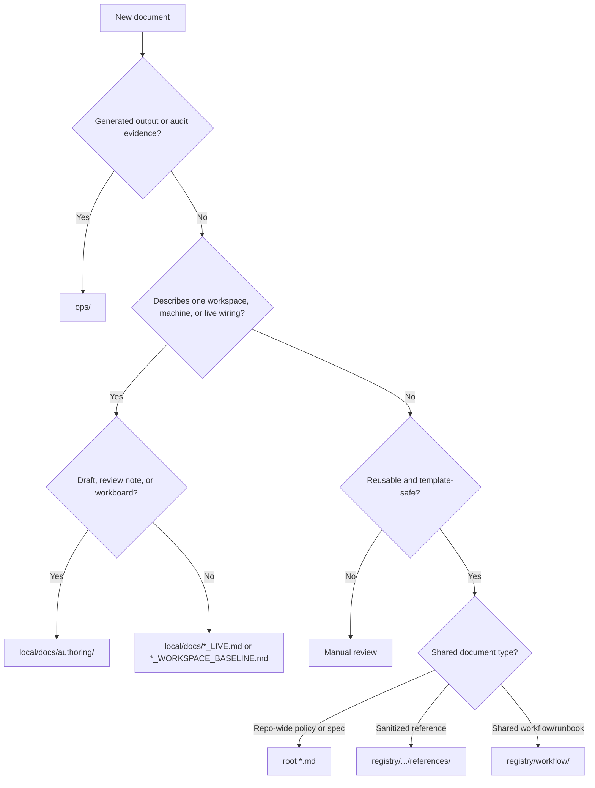

# UniText — 文件放置政策

> 狀態：Active Baseline
> 角色：決定文件該放在哪一層（repo、registry、local、ops）以及是否為 trackable。

## 目的

UniText 同時是：

- authoring workspace
- shared registry baseline
- template / rebuild export source

最常見的錯誤通常不是主題不對，而是「主題對了，真相層級放錯」。

這份文件回答：

- 哪些文件是 repo-wide shared guidance
- 哪些是 shared reference
- 哪些是 local live state
- 哪些是 operations output
- 哪些該 tracked，哪些不該 track

## 關鍵名詞

- **shared canonical document**：多人重複引用、可被審查、可模板化的共享文件。
- **local live document**：描述單一作者工作區、單一機器、單一部署或目前 wiring 狀態的文件。
- **operations artifact**：執行過程產生的報告、drift、匯出物、review package 與 evidence。
- **share-safe**：即使被他人讀取，也不會洩漏 live workspace 值、秘密、機器特定拓樸或敏感策略內容。
- **ignored local authoring space**：供作者本機草稿、review notes、workboard 的區域（例如 `local/docs/authoring/`）。



## 放置矩陣

| 文件類型 | 建議位置 | Tracked | Share-safe | 說明 |
|---|---|---|---|---|
| repo-wide 政策與規格 | root `*.md` | Yes | Yes | 避免 live workspace 值 |
| shared reference | `registry/.../references/` | Yes | Yes | 只保留結構、placeholder、redacted 範例 |
| reusable workflow/runbook | `registry/workflow/` | Yes | Yes | 不可綁定單一作者機器 |
| local wiring note / path map | `local/docs/` | Case-by-case | Usually no | 不可記錄明文 secret |
| live workspace baseline | `local/docs/*_WORKSPACE_BASELINE.md` | No | No | local-only 並由 ignore 保護 |
| live operation checklist | `local/docs/*_LIVE.md` | No | No | local-only 並由 ignore 保護 |
| draft、review notes、workboard | `local/docs/authoring/` | No | No | 只供本機作者編修 |
| audit、drift、resolver output | `ops/<tool-or-domain>/` | No | No | 屬於 evidence 或 state |

## 成對文件規則

若同一主題需同時有 shared guidance 與 live 版，請維持 pairing：

- shared 版：保留結構、規則、placeholder
- live 版：保留真實工作區值與目前狀態
- shared 版應明確指出 live 版位置
- live 版應回連到 shared reference

## 常見誤放

- 把 live deployment baseline 放到 `registry/.../references/`
- 把策略草稿或 review plan 放到 root
- 把 export output 當 canonical reference
- 把 resolver 產物寫到 repo root
- 把 machine-specific path 直接寫進 shared governance docs

## 工具輔助

```powershell
powershell -NoProfile -ExecutionPolicy Bypass -File .\local\scripts\get-document-placement-recommendation.ps1 -Topic "deployment-provider workflow" -CanonicalSharedTruth -SharedForm registry-reference
```

## 審查清單

新增任何 governance / reference 類文件前，至少確認：

- 它描述 shared truth 還是 live workspace state
- 若它被 share 或 export，是否仍 share-safe
- 是否有對應 live 版
- 若是 tracked shared doc，是否避開 workspace-sensitive metadata
- 若是 output 或 evidence，是否已放入 `ops/`

## 相關文件

- `README.md`
- `README.zh-TW.md`
- `INDEX.md`
- `OPERATIONS.md`
- `PROJECT_MODES.md`
- `NO_PUBLISH_POLICY.md`
- `SECRET_HANDLING_GUIDELINES.md`
- `WORKSPACE_SENSITIVE_METADATA_RULES.md`
