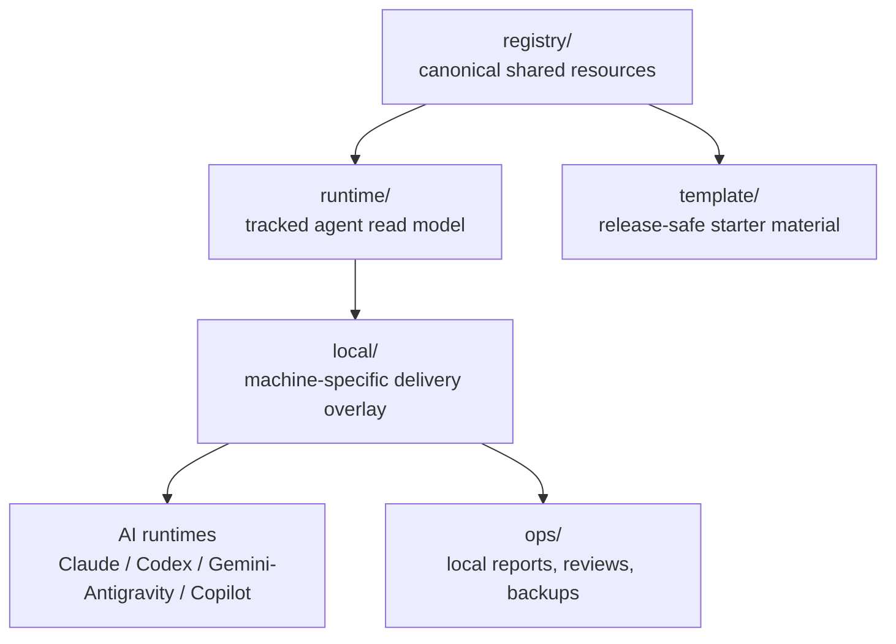

# UniText

[Overview](#overview) · [Architecture](#architecture) · [Quick Start](#quick-start) · [Runtime](#runtime-for-agents) · [Docs](#documentation-map) · [繁體中文](README.zh-TW.md)

> Registry-first governance for shared AI agent resources across Claude Code, Codex, Gemini / Antigravity, GitHub Copilot, and adjacent runtimes.

  

UniText keeps skills, MCP definitions, agent instructions, workflow templates, runtime projections, and local delivery wiring in one reviewable source of truth. The goal is simple: author shared resources once, expose a low-noise runtime view to agents, and deliver into host tools only through dry-run, review, backup, and verification gates.

UniText is local-first. A clean publishability report, private remote, or GitHub template does not grant permission to push, upload, paste, or publish repository content. Publication always requires explicit user approval.

---

## Overview

| Need | UniText surface |
|---|---|
| Author shared resources | `registry/` holds canonical skills, MCP definitions, agents, and workflows |
| Give agents a short startup path | `RUNTIME.md` and `runtime/` provide a discovery-first read model |
| Wire local tools safely | `local/` contains bootstrap, verify, sync, and boundary scripts |
| Keep generated evidence local | `ops/` stores reports, review packages, backups, and evidence bundles |
| Export clean starters | `template/` contains release-safe starter material |

UniText does not replace Claude, Codex, Gemini / Antigravity, or Copilot configuration formats. It gives them a common governance layer so the same resource can be reviewed once and then projected into each runtime surface deliberately.

---

## What It Solves

| Problem | UniText approach |
|---|---|
| Skills are scattered across tool-specific folders | Maintain canonical entries in `registry/skills`, then build runtime projections |
| MCP definitions drift between hosts | Keep definitions under `registry/mcp` and deliver host config through reviewed scripts |
| Agent instructions are hard to reuse | Manage shared personas and rules under `registry/agents` and adapter notes |
| Long prompts become tribal knowledge | Store repeatable procedures under `registry/workflow` |
| Agents read too much too early | Route consumer agents through `RUNTIME.md` and `runtime/catalog.json` |
| Local metadata leaks into shared docs | Validate shared surfaces against workspace-sensitive metadata rules |

---

## Architecture



| Layer | Role | Rule |
|---|---|---|
| `registry/` | Canonical authoring source | Shared resources enter only after review |
| `runtime/` | Consumer-agent read model | Generated from registry; agents read this before deep source docs |
| `local/` | Machine-local wiring | Absolute paths, local config, and operational state stay here |
| `ops/` | Operational artifacts | Generated reports and packages stay local unless approved |
| `template/` | Starter release material | Contains only release-safe examples and bootstrap inputs |

---

## Quick Start

### Windows

```powershell
# 1. Inspect repo, branch, and worktree state.
powershell -NoProfile -ExecutionPolicy Bypass -File .\local\scripts\git-startup.ps1

# 2. Preview local runtime and CLI wiring changes.
python .\local\scripts\bootstrap.py --dry-run

# 3. Apply only after reviewing the dry-run output.
python .\local\scripts\bootstrap.py --force

# 4. Verify the local runtime alignment.
python .\local\scripts\verify-bootstrap.py
```

### macOS / Linux

```bash
python local/scripts/bootstrap.py --dry-run
python local/scripts/bootstrap.py --force
python local/scripts/verify-bootstrap.py
```

---

## Runtime For Agents

Agents and automation should start here:

```text
RUNTIME.md
runtime/START.md
runtime/RULES.md
runtime/ROUTES.md
runtime/catalog.json
```

Use `INDEX.md`, `VISION.md`, and `RESOURCE_SPEC.md` only when the task needs human-facing context, architecture rationale, or the resource contract. Do not treat `INDEX.md` as the default agent startup surface.

---

## Command Reference

| Command | Description |
|---|---|
| `python local/scripts/build-runtime-layer.py --write` | Rebuild tracked `runtime/` projections and `runtime/catalog.json` from `registry/` |
| `python local/scripts/build-runtime-layer.py` | Dry-run runtime generation without changing tracked runtime files |
| `python local/scripts/bootstrap.py --dry-run` | Preview local runtime delivery and CLI wiring changes |
| `python local/scripts/bootstrap.py --force` | Apply the reviewed bootstrap plan |
| `python local/scripts/verify-bootstrap.py` | Check local runtime, Codex, Copilot, and project MCP alignment |
| `python local/scripts/verify-workspace-boundaries.py --format json` | Detect shared-surface leaks of local workspace metadata |
| `python local/scripts/audit-i18n-drift.py --format json --sample-size 0 --exit-zero` | Report Traditional Chinese companion coverage and drift |
| `python local/scripts/get-publishability-report.py` | Produce a local-only structural publishability report |
| `powershell -File .\local\scripts\sync-skills.ps1 -DryRun` | Preview Windows skills mirroring from `runtime/skills` |
| `python -m unittest discover -s tests -p "test*.py"` | Run the recursive test baseline |

---

## Resource Types

| Type | Canonical root | Runtime projection | Purpose |
|---|---|---|---|
| `skill` | `registry/skills` | `runtime/skills` | Agent skills, procedural capability packs, and support files |
| `mcp` | `registry/mcp` | `runtime/catalog.json` plus project `.mcp.json` | MCP server definitions and read-only project wiring |
| `agent` | `registry/agents` | `runtime/agents` | Shared personas, playbooks, and role instructions |
| `workflow` | `registry/workflow` | `runtime/workflow` | Repeatable runbooks, plan templates, and operating procedures |

For human discovery, use [INDEX.md](INDEX.md). For runtime discovery, use [runtime/catalog.json](runtime/catalog.json). For the metadata contract, use [RESOURCE_SPEC.md](RESOURCE_SPEC.md).

---

## Safety Model

| Boundary | Policy |
|---|---|
| Remote publication | No push, upload, paste, social post, or cloud-doc copy without explicit user approval |
| Config mutation | Dry-run first, then apply only after reviewing the plan |
| Local-only material | Keep live paths, sensitive notes, and operational state under `local/` or ignored `ops/` outputs |
| Deletion requests | Move to `.del` or `.clean`; do not permanently remove files unless explicitly requested |
| Runtime generation | Treat unexpected projection drift as a review item before committing |
| GitHub templates | Local templates are not publication approval and must not invite sensitive disclosures |

See [NO_PUBLISH_POLICY.md](NO_PUBLISH_POLICY.md), [SECRET_HANDLING_GUIDELINES.md](SECRET_HANDLING_GUIDELINES.md), and [WORKSPACE_SENSITIVE_METADATA_RULES.md](WORKSPACE_SENSITIVE_METADATA_RULES.md) before preparing any external package.

---

## Documentation Map

| File | Purpose |
|---|---|
| [RUNTIME.md](RUNTIME.md) | Agent-first startup entrypoint |
| [INDEX.md](INDEX.md) | Human discovery, catalog excerpts, and task routing |
| [VISION.md](VISION.md) | Why UniText uses registry-first and runtime-first architecture |
| [RESOURCE_SPEC.md](RESOURCE_SPEC.md) | Metadata and projection contract for shared resources |
| [OPERATIONS.md](OPERATIONS.md) | Delivery modes, backup rules, mutation gates, and troubleshooting |
| [PROJECT_MODES.md](PROJECT_MODES.md) | Authoring workspace vs. starter-template distinction |
| [DOCUMENT_PLACEMENT_POLICY.md](DOCUMENT_PLACEMENT_POLICY.md) | Where shared, local, authoring, and operations docs belong |
| [TEMPLATE_RELEASE_PACKAGE.md](TEMPLATE_RELEASE_PACKAGE.md) | Template release scope and exclusions |
| [docs/adapters/CLAUDE_CODE_ADAPTER_NOTE.md](docs/adapters/CLAUDE_CODE_ADAPTER_NOTE.md) | Claude Code compatibility surface |
| [docs/adapters/CODEX_CLI_ADAPTER_NOTE.md](docs/adapters/CODEX_CLI_ADAPTER_NOTE.md) | Codex compatibility surface |
| [docs/adapters/COPILOT_CLI_ADAPTER_NOTE.md](docs/adapters/COPILOT_CLI_ADAPTER_NOTE.md) | GitHub Copilot compatibility surface |
| [docs/adapters/GEMINI_ANTIGRAVITY_ADAPTER_NOTE.md](docs/adapters/GEMINI_ANTIGRAVITY_ADAPTER_NOTE.md) | Gemini / Antigravity transition note |

---

## Testing

```bash
# Fast recursive baseline
python -m unittest discover -s tests -p "test*.py"

# Focused registry and runtime smoke tests
python -m unittest tests.test_registry_inventory tests.test_bootstrap_verify_smoke tests.test_runtime_bundle_hidden_entries

# Governance checks used for documentation changes
python -m unittest tests.test_registry_inventory tests.security.test_i18n_drift tests.security.test_workspace_sensitive_metadata tests.security.test_release_hygiene
```

The maintained test baseline is documented in [TEST_BASELINE.md](TEST_BASELINE.md).

---

## AI-Assisted Development

This project was developed with AI assistance.

| Model | Role |
|---|---|
| OpenAI Codex CLI | Documentation authoring, repository inspection, implementation, and validation |
| Claude Code | Prior architecture exploration, skill workflow design, review, and planning support |
| Gemini CLI | Cross-CLI compatibility target and adjacent review surface |

> ⚠️ **Disclaimer:** While the author has made every effort to review and validate the AI-generated code and documentation, no guarantee can be made regarding its correctness, security, or fitness for any particular purpose. Use at your own risk.

---

## License

[MIT License](LICENSE)
