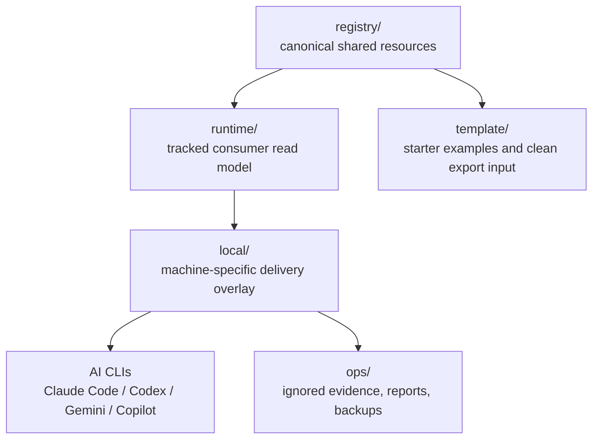

# UniText

[Overview](#overview) · [Architecture](#architecture) · [Quick Start](#quick-start) · [Commands](#command-reference) · [Documentation](#documentation) · [繁體中文](README.zh-TW.md)

> Text-native shared resource governance for Claude Code, Codex, Gemini CLI, Copilot CLI, and adjacent AI agent runtimes.

  

UniText keeps AI agent resources in one governed source of truth: skills, MCP definitions, agent personas, workflow templates, runtime projections, and local delivery wiring. The registry stays platform-agnostic, the runtime layer gives consumer agents a low-noise read model, and local scripts connect that model to real CLI targets without silently publishing or overwriting machine state.

---

## Overview

| Need | UniText surface |
|---|---|
| Define shared resources | `registry/` — canonical skill, MCP, agent, and workflow definitions |
| Give agents a stable startup path | `runtime/` — tracked runtime read model and projected skill entrypoints |
| Wire this machine | `local/` — scripts, config manifests, and local-only operational notes |
| Preserve audit history | `ops/` — generated reports, review packages, backups, and evidence bundles |
| Export clean starters | `template/` plus rebuild scripts — shareable project skeletons without live workspace metadata |

UniText is optimized for local-first AI tooling governance. Publishing, pushing, or uploading any repository content still requires explicit user approval, even when a remote already exists or a report says the shared surfaces are structurally publishable.

---

## Features

| Feature | Description |
|---|---|
| **Registry-first resources** | Canonical skills, MCP definitions, agents, and workflows — stable identities before delivery |
| **Runtime-first consumer model** | `RUNTIME.md`, `runtime/START.md`, `runtime/ROUTES.md`, and `runtime/catalog.json` — low-noise startup path for agents |
| **Multi-CLI delivery planning** | Claude, Codex, Gemini, and Copilot surfaces — mirror, symlink, native config, and project-local MCP wiring |
| **Governed local mutation** | Dry-run, backup, and verify gates — no silent sync or destructive cleanup |
| **Template and rebuild exports** | Reviewable packages for starter release, fresh-project rebuild, and external audit handoff |
| **Boundary validation** | Workspace-sensitive metadata rules, publishability reports, and no-publish policy checks |
| **Project map UI** | Static and interactive project-map artifacts — operator view, share-safe view, and handoff metadata |

---

## Architecture



| Layer | Role | Rule |
|---|---|---|
| `registry/` | Canonical authoring source | Shared resources belong here only after review |
| `runtime/` | Consumer-agent read model | Generated from registry; agents read this before source docs |
| `local/` | Machine-local wiring | Absolute paths, local config, and operational state stay here |
| `ops/` | Operational artifacts | Generated reports and packages stay local unless explicitly approved |
| `template/` | Starter examples | Clean bootstrap material for future projects |

---

## Quick Start

### Windows

```powershell
# 1. Inspect the repo and branch state before changes.
powershell -NoProfile -ExecutionPolicy Bypass -File .\local\scripts\git-startup.ps1

# 2. Preview local runtime and CLI wiring changes.
python .\local\scripts\bootstrap.py --dry-run

# 3. Apply bootstrap only after the dry-run output is acceptable.
python .\local\scripts\bootstrap.py --force

# 4. Verify the local runtime alignment.
python .\local\scripts\verify-bootstrap.py
```

### Linux / macOS

```bash
# 1. Preview the bootstrap plan.
python local/scripts/bootstrap.py --dry-run

# 2. Apply local runtime and CLI wiring.
python local/scripts/bootstrap.py --force

# 3. Verify the resulting local setup.
python local/scripts/verify-bootstrap.py
```

### Runtime-only agent reading path

```text
RUNTIME.md
runtime/START.md
runtime/RULES.md
runtime/ROUTES.md
runtime/catalog.json
```

---

## Command Reference

| Command | Description |
|---|---|
| `python local/scripts/build-runtime-layer.py --write` | Rebuild tracked `runtime/` projections and `runtime/catalog.json` from `registry/` |
| `python local/scripts/bootstrap.py --dry-run` | Preview local runtime delivery and CLI wiring changes |
| `python local/scripts/bootstrap.py --force` | Apply the reviewed bootstrap plan |
| `python local/scripts/verify-bootstrap.py` | Check local runtime, Codex, Copilot, and project MCP alignment |
| `python local/scripts/verify-workspace-boundaries.py` | Detect shared-surface leaks of local workspace metadata |
| `python local/scripts/get-publishability-report.py` | Produce a local-only structural publishability report |
| `python local/scripts/generate-push-suitability-report.py` | Aggregate bootstrap, boundary, publishability, and git tracking signals |
| `powershell -File .\local\scripts\sync-skills.ps1 -DryRun` | Preview Windows skills mirroring from `runtime/skills` |
| `python -m unittest discover -s tests -p "test*.py"` | Run the recursive test baseline |

---

## Resource Catalog

| Type | Canonical root | Runtime projection | Purpose |
|---|---|---|---|
| `skills` | `/registry/skills` | `runtime/skills` | Agent skills, tool workflows, and procedural capability packs |
| `mcp` | `/registry/mcp` | `runtime/catalog.json` plus project `.mcp.json` | MCP server definitions and project-local read-only server wiring |
| `agents` | `/registry/agents` | `runtime/agents` | Shared agent personas, playbooks, and role instructions |
| `workflow` | `/registry/workflow` | `runtime/workflow` | Shared runbooks, plan templates, and repeatable procedures |

The review-facing catalog is intentionally smaller than the full inventory. Start with [INDEX.md](INDEX.md) for human discovery and [runtime/catalog.json](runtime/catalog.json) for the runtime read model.

---

## Safety Model

| Boundary | Policy |
|---|---|
| Remote publication | No push, upload, paste, or social publication without explicit user approval |
| Config mutation | Dry-run first, then apply only after reviewing the plan |
| Local-only material | Keep live paths, sensitive notes, and operational state under `local/` or ignored `ops/` outputs |
| Deletion requests | Move to `.del` or `.clean`; do not permanently remove files unless explicitly requested |
| Runtime generation | Treat unexpected projection drift as a review item before committing |

See [NO_PUBLISH_POLICY.md](NO_PUBLISH_POLICY.md), [SECRET_HANDLING_GUIDELINES.md](SECRET_HANDLING_GUIDELINES.md), and [WORKSPACE_SENSITIVE_METADATA_RULES.md](WORKSPACE_SENSITIVE_METADATA_RULES.md) before preparing any external package.

---

## Testing

```bash
# Fast recursive baseline
python -m unittest discover -s tests -p "test*.py"

# Focused registry and runtime smoke tests
python -m unittest tests.test_registry_inventory tests.test_bootstrap_verify_smoke tests.test_runtime_bundle_hidden_entries

# Workspace-sensitive and release hygiene checks
python -m unittest tests.security.test_workspace_sensitive_metadata tests.security.test_release_hygiene tests.security.test_rebuild_first_run
```

| Test area | Coverage |
|---|---|
| Bootstrap smoke | Isolated temp-home `bootstrap.py` and `verify-bootstrap.py` flow |
| Registry inventory | Required skill families, hidden-directory exclusions, canonical casing |
| Runtime bundle | Materialized Codex bundle handling and hidden overlay exclusions |
| Project map | Generated interactive/share-safe artifacts and browser smoke |
| Security governance | Workspace-sensitive metadata, release hygiene, rebuild-first-run, self-repair simulation |

The maintained test baseline is documented in [TEST_BASELINE.md](TEST_BASELINE.md).

---

## Documentation

| File | Purpose |
|---|---|
| [RUNTIME.md](RUNTIME.md) | Agent-first startup entrypoint |
| [INDEX.md](INDEX.md) | Human discovery and catalog orientation |
| [VISION.md](VISION.md) | Architecture principles and rationale |
| [RESOURCE_SPEC.md](RESOURCE_SPEC.md) | Metadata contract for shared resources |
| [OPERATIONS.md](OPERATIONS.md) | Delivery modes, backup rules, and mutation gates |
| [PROJECT_MODES.md](PROJECT_MODES.md) | Authoring workspace vs. starter-template distinction |
| [DOCUMENT_PLACEMENT_POLICY.md](DOCUMENT_PLACEMENT_POLICY.md) | Where shared, local, authoring, and operations docs belong |
| [REBUILD_AS_NEW_PROJECT.md](REBUILD_AS_NEW_PROJECT.md) | Clean fresh-project rebuild flow |
| [TEMPLATE_RELEASE_PACKAGE.md](TEMPLATE_RELEASE_PACKAGE.md) | Template release scope and exclusions |
| [docs/adapters/COPILOT_CLI_ADAPTER_NOTE.md](docs/adapters/COPILOT_CLI_ADAPTER_NOTE.md) | Copilot CLI adapter scope and limits |
| [web/project-map-ui/README.md](web/project-map-ui/README.md) | Standalone project-map UI source and build path |

---

## AI-Assisted Development

This project was developed with AI assistance.

| Model | Role |
|---|---|
| OpenAI Codex CLI | Implementation partner, repository audit, README rewrite, validation |
| Claude Code | Prior architecture exploration, skill workflow design, review and planning support |
| Gemini CLI | Cross-CLI compatibility target and adjacent review surface |

> ⚠️ **Disclaimer:** While the author has made every effort to review and validate
> the AI-generated code, no guarantee can be made regarding its correctness, security,
> or fitness for any particular purpose. Use at your own risk.

---

## License

[MIT License](LICENSE)
