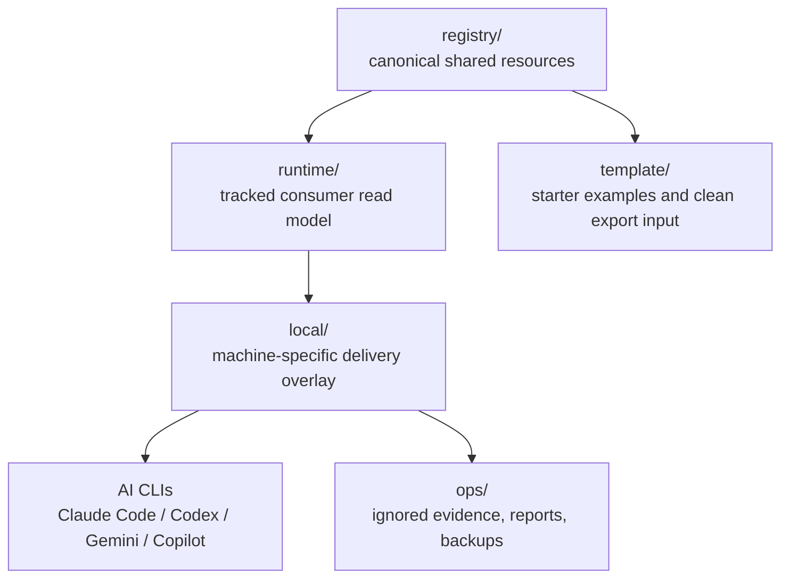

# UniText

[概覽](#概覽) · [架構](#架構) · [快速開始](#快速開始) · [指令參考](#指令參考) · [文件](#文件) · [English](README.md)

> 給 Claude Code、Codex、Gemini CLI、Copilot CLI 與相鄰 AI agent runtime 使用的純文本共享資源治理層。

  

UniText 把 AI agent 資源維持在一個受治理的 source of truth：skills、MCP definitions、agent personas、workflow templates、runtime projections，以及本機 delivery wiring。`registry/` 保持平台無關，`runtime/` 提供 consumer agents 低噪音讀取模型，`local/` 腳本再把 runtime surface 接到真實 CLI target，而且不會默默 publish 或覆寫機器狀態。

---

## 概覽

| 需求 | UniText surface |
|---|---|
| 定義共享資源 | `registry/` — canonical skill、MCP、agent、workflow definitions |
| 給 agent 穩定 startup path | `runtime/` — tracked runtime read model 與 projected skill entrypoints |
| 對接這台機器 | `local/` — scripts、config manifests、本機操作筆記 |
| 保留 audit history | `ops/` — generated reports、review packages、backups、evidence bundles |
| 匯出乾淨 starter | `template/` 加上 rebuild scripts — 不含 live workspace metadata 的可共享 skeleton |

UniText 以 local-first AI tooling governance 為核心。即使 remote 已存在，或報告顯示 shared surfaces 在結構上可 publish，任何 publish、push、upload 都仍需要使用者明確授權。

---

## Features

| Feature | Description |
|---|---|
| **Registry-first resources** | Canonical skills、MCP definitions、agents、workflows — 先有穩定 identity 再 delivery |
| **Runtime-first consumer model** | `RUNTIME.md`、`runtime/START.md`、`runtime/ROUTES.md`、`runtime/catalog.json` — 給 agents 的低噪音 startup path |
| **Multi-CLI delivery planning** | Claude、Codex、Gemini、Copilot surfaces — mirror、symlink、native config、project-local MCP wiring |
| **Governed local mutation** | Dry-run、backup、verify gates — 不做 silent sync 或 destructive cleanup |
| **Template and rebuild exports** | Starter release、fresh-project rebuild、external audit handoff 的 reviewable packages |
| **Boundary validation** | Workspace-sensitive metadata rules、publishability reports、no-publish policy checks |
| **Project map UI** | Static 與 interactive project-map artifacts — operator view、share-safe view、handoff metadata |

---

## 架構



| Layer | Role | Rule |
|---|---|---|
| `registry/` | Canonical authoring source | Shared resources 經 review 後才進入這裡 |
| `runtime/` | Consumer-agent read model | 從 registry 生成；agent 先讀 runtime 再回 source docs |
| `local/` | Machine-local wiring | 絕對路徑、本機 config、operational state 放這裡 |
| `ops/` | Operational artifacts | Generated reports 與 packages 預設留本機，除非使用者明確批准 |
| `template/` | Starter examples | 未來專案的 clean bootstrap material |

---

## 快速開始

### Windows

```powershell
# 1. 改動前先檢查 repo 與 branch state。
powershell -NoProfile -ExecutionPolicy Bypass -File .\local\scripts\git-startup.ps1

# 2. 預覽 local runtime 與 CLI wiring 變更。
python .\local\scripts\bootstrap.py --dry-run

# 3. dry-run 輸出可接受後才套用 bootstrap。
python .\local\scripts\bootstrap.py --force

# 4. 驗證 local runtime alignment。
python .\local\scripts\verify-bootstrap.py
```

### Linux / macOS

```bash
# 1. 預覽 bootstrap plan。
python local/scripts/bootstrap.py --dry-run

# 2. 套用 local runtime 與 CLI wiring。
python local/scripts/bootstrap.py --force

# 3. 驗證產出的 local setup。
python local/scripts/verify-bootstrap.py
```

### Runtime-only agent reading path

```text
RUNTIME.md
runtime/START.md
runtime/RULES.md
runtime/ROUTES.md
runtime/catalog.json
```

---

## 指令參考

| Command | Description |
|---|---|
| `python local/scripts/build-runtime-layer.py --write` | 從 `registry/` 重建 tracked `runtime/` projections 與 `runtime/catalog.json` |
| `python local/scripts/bootstrap.py --dry-run` | 預覽 local runtime delivery 與 CLI wiring changes |
| `python local/scripts/bootstrap.py --force` | 套用已 review 的 bootstrap plan |
| `python local/scripts/verify-bootstrap.py` | 檢查 local runtime、Codex、Copilot、project MCP alignment |
| `python local/scripts/verify-workspace-boundaries.py` | 偵測 shared-surface 是否混入 local workspace metadata |
| `python local/scripts/get-publishability-report.py` | 產生 local-only structural publishability report |
| `python local/scripts/generate-push-suitability-report.py` | 聚合 bootstrap、boundary、publishability、git tracking signals |
| `powershell -File .\local\scripts\sync-skills.ps1 -DryRun` | 預覽 Windows skills mirroring from `runtime/skills` |
| `python -m unittest discover -s tests -p "test*.py"` | 執行 recursive test baseline |

---

## Resource Catalog

| Type | Canonical root | Runtime projection | Purpose |
|---|---|---|---|
| `skills` | `/registry/skills` | `runtime/skills` | Agent skills、tool workflows、procedural capability packs |
| `mcp` | `/registry/mcp` | `runtime/catalog.json` plus project `.mcp.json` | MCP server definitions 與 project-local read-only server wiring |
| `agents` | `/registry/agents` | `runtime/agents` | Shared agent personas、playbooks、role instructions |
| `workflow` | `/registry/workflow` | `runtime/workflow` | Shared runbooks、plan templates、repeatable procedures |

Review-facing catalog 會刻意小於完整 inventory。Human discovery 先看 [INDEX.md](INDEX.md)，runtime read model 先看 [runtime/catalog.json](runtime/catalog.json)。

---

## Safety Model

| Boundary | Policy |
|---|---|
| Remote publication | 沒有使用者明確授權時，不 push、upload、paste 或 publish |
| Config mutation | 先 dry-run，再 review plan，最後才 apply |
| Local-only material | Live paths、敏感筆記、operational state 放在 `local/` 或 ignored `ops/` output |
| Deletion requests | 移到 `.del` 或 `.clean`；除非明確要求永久刪除，否則不 permanent remove |
| Runtime generation | Unexpected projection drift 先當作 review item，再決定是否 commit |

準備任何外部 package 前，先看 [NO_PUBLISH_POLICY.md](NO_PUBLISH_POLICY.md)、[SECRET_HANDLING_GUIDELINES.md](SECRET_HANDLING_GUIDELINES.md)、[WORKSPACE_SENSITIVE_METADATA_RULES.md](WORKSPACE_SENSITIVE_METADATA_RULES.md)。

---

## 測試

```bash
# Fast recursive baseline
python -m unittest discover -s tests -p "test*.py"

# Focused registry and runtime smoke tests
python -m unittest tests.test_registry_inventory tests.test_bootstrap_verify_smoke tests.test_runtime_bundle_hidden_entries

# Workspace-sensitive and release hygiene checks
python -m unittest tests.security.test_workspace_sensitive_metadata tests.security.test_release_hygiene tests.security.test_rebuild_first_run
```

| Test area | Coverage |
|---|---|
| Bootstrap smoke | Isolated temp-home `bootstrap.py` and `verify-bootstrap.py` flow |
| Registry inventory | Required skill families、hidden-directory exclusions、canonical casing |
| Runtime bundle | Materialized Codex bundle handling and hidden overlay exclusions |
| Project map | Generated interactive/share-safe artifacts and browser smoke |
| Security governance | Workspace-sensitive metadata、release hygiene、rebuild-first-run、self-repair simulation |

維護中的 test baseline 記錄於 [TEST_BASELINE.md](TEST_BASELINE.md)。

---

## 文件

| File | Purpose |
|---|---|
| [RUNTIME.md](RUNTIME.md) | Agent-first startup entrypoint |
| [INDEX.md](INDEX.md) | Human discovery and catalog orientation |
| [VISION.md](VISION.md) | Architecture principles and rationale |
| [RESOURCE_SPEC.md](RESOURCE_SPEC.md) | Metadata contract for shared resources |
| [OPERATIONS.md](OPERATIONS.md) | Delivery modes、backup rules、mutation gates |
| [PROJECT_MODES.md](PROJECT_MODES.md) | Authoring workspace vs. starter-template distinction |
| [DOCUMENT_PLACEMENT_POLICY.md](DOCUMENT_PLACEMENT_POLICY.md) | Shared、local、authoring、operations docs 的落點規則 |
| [REBUILD_AS_NEW_PROJECT.md](REBUILD_AS_NEW_PROJECT.md) | Clean fresh-project rebuild flow |
| [TEMPLATE_RELEASE_PACKAGE.md](TEMPLATE_RELEASE_PACKAGE.md) | Template release scope and exclusions |
| [docs/adapters/COPILOT_CLI_ADAPTER_NOTE.md](docs/adapters/COPILOT_CLI_ADAPTER_NOTE.md) | Copilot CLI adapter scope and limits |
| [web/project-map-ui/README.md](web/project-map-ui/README.md) | Standalone project-map UI source and build path |

---

## AI-Assisted Development

This project was developed with AI assistance.

| Model | Role |
|---|---|
| OpenAI Codex CLI | Implementation partner、repository audit、README rewrite、validation |
| Claude Code | Prior architecture exploration、skill workflow design、review and planning support |
| Gemini CLI | Cross-CLI compatibility target and adjacent review surface |

> ⚠️ **Disclaimer:** While the author has made every effort to review and validate
> the AI-generated code, no guarantee can be made regarding its correctness, security,
> or fitness for any particular purpose. Use at your own risk.

---

## License

[MIT License](LICENSE)
