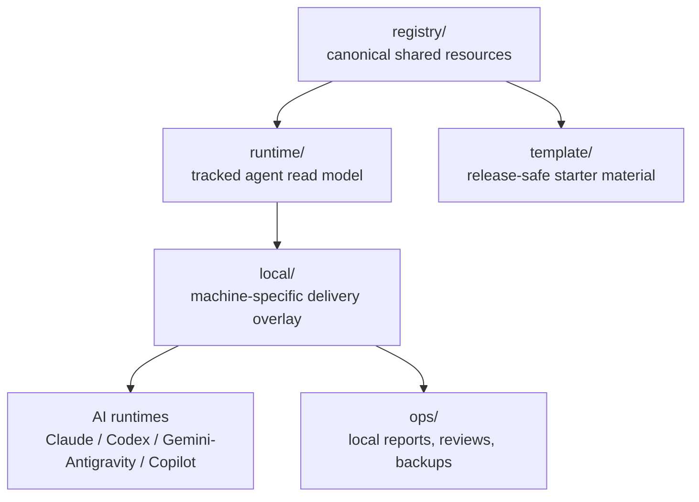

# UniText

[總覽](#總覽) · [架構](#架構) · [快速開始](#快速開始) · [Agent 用 Runtime](#agent-用-runtime) · [文件地圖](#文件地圖) · [English](README.md)

> 以 Registry 優先（registry-first）的治理模式，管理 Claude Code、Codex、Gemini / Antigravity、GitHub Copilot，以及相鄰 runtime 之間共用的 AI agent 資源。

  

UniText 將 skills、MCP definitions、agent instructions、workflow templates、runtime projections，以及 local delivery wiring，集中維護在同一個可審查的單一可信來源。目標很單純：共用資源只撰寫一次，對 agent 暴露低噪音的 runtime view，並且只有在通過 dry-run、審查、備份與驗證關卡後，才交付到 host tools。

UniText 採用 local-first（本機優先）設計。乾淨的 publishability report、private remote，或 GitHub template，都不代表已取得 push、upload、paste 或 publish repository content 的權限。任何發布行為都必須取得使用者的明確同意。

---

## 總覽

| 需求 | UniText 介面 |
|---|---|
| 撰寫共用資源 | `registry/` 保存 canonical skills、MCP definitions、agents 與 workflows |
| 提供 agent 簡短的啟動路徑 | `RUNTIME.md` 與 `runtime/` 提供 discovery-first 的讀取模型 |
| 安全串接本機工具 | `local/` 包含 bootstrap、verify、sync 與 boundary scripts |
| 將產生的證據保留在本機 | `ops/` 儲存 reports、review packages、backups 與 evidence bundles |
| 匯出乾淨的 starter | `template/` 包含 release-safe 的 starter material |

UniText 不會取代 Claude、Codex、Gemini / Antigravity 或 Copilot 的 configuration formats。它提供一個共同的治理層，讓同一份資源可以先被審查一次，再有意識地投影到各個 runtime surface。

---

## 解決的問題

| 問題 | UniText 作法 |
|---|---|
| Skills 分散在各工具專屬資料夾 | 在 `registry/skills` 維護 canonical entries，接著建立 runtime projections |
| MCP definitions 在不同 hosts 之間產生 drift | 將 definitions 保存在 `registry/mcp` 下，並透過已審查的 scripts 交付 host config |
| Agent instructions 難以重複使用 | 在 `registry/agents` 與 adapter notes 下管理共用 personas 與 rules |
| 長 prompts 變成團隊內隱知識 | 將可重複的 procedures 存放在 `registry/workflow` |
| Agents 太早讀取過多內容 | 透過 `RUNTIME.md` 與 `runtime/catalog.json` 將 consumer agents 導向正確入口 |
| 本機 metadata 洩漏到共用文件 | 根據 workspace-sensitive metadata rules 驗證 shared surfaces |

---

## 架構



| Layer | 角色 | 規則 |
|---|---|---|
| `registry/` | Canonical authoring source | 共用資源只有在審查後才進入這一層 |
| `runtime/` | Consumer-agent read model | 由 registry 產生；agents 應先讀取這一層，再深入 source docs |
| `local/` | Machine-local wiring | 絕對路徑、本機 config 與 operational state 都留在這裡 |
| `ops/` | Operational artifacts | 產生的 reports 與 packages 留在本機，除非已獲核准 |
| `template/` | Starter release material | 只包含 release-safe 的範例與 bootstrap inputs |

---

## 快速開始

### Windows

```powershell
# 1. Inspect repo, branch, and worktree state.
powershell -NoProfile -ExecutionPolicy Bypass -File .\local\scripts\git-startup.ps1

# 2. Preview local runtime and CLI wiring changes.
python .\local\scripts\bootstrap.py --dry-run

# 3. Apply only after reviewing the dry-run output.
python .\local\scripts\bootstrap.py --force

# 4. Verify the local runtime alignment.
python .\local\scripts\verify-bootstrap.py
```

### macOS / Linux

```bash
python local/scripts/bootstrap.py --dry-run
python local/scripts/bootstrap.py --force
python local/scripts/verify-bootstrap.py
```

---

## Agent 用 Runtime

Agents 與 automation 應該從這裡開始：

```text
RUNTIME.md
runtime/START.md
runtime/RULES.md
runtime/ROUTES.md
runtime/catalog.json
```

只有在任務需要 human-facing context、architecture rationale 或 resource contract 時，才使用 `INDEX.md`、`VISION.md` 與 `RESOURCE_SPEC.md`。不要把 `INDEX.md` 當成預設的 agent startup surface。

---

## 指令參考

| 指令 | 說明 |
|---|---|
| `python local/scripts/build-runtime-layer.py --write` | 從 `registry/` 重新建置已追蹤的 `runtime/` projections 與 `runtime/catalog.json` |
| `python local/scripts/build-runtime-layer.py` | 執行 dry-run runtime generation，不變更已追蹤的 runtime files |
| `python local/scripts/bootstrap.py --dry-run` | 預覽本機 runtime delivery 與 CLI wiring changes |
| `python local/scripts/bootstrap.py --force` | 套用已審查的 bootstrap plan |
| `python local/scripts/verify-bootstrap.py` | 檢查本機 runtime、Codex、Copilot 與 project MCP alignment |
| `python local/scripts/verify-workspace-boundaries.py --format json` | 偵測 shared-surface 中是否洩漏本機 workspace metadata |
| `python local/scripts/audit-i18n-drift.py --format json --sample-size 0 --exit-zero` | 回報 Traditional Chinese companion coverage 與 drift |
| `python local/scripts/get-publishability-report.py` | 產生 local-only 的結構性 publishability report |
| `powershell -File .\local\scripts\sync-skills.ps1 -DryRun` | 預覽 Windows skills mirroring，來源為 `runtime/skills` |
| `python -m unittest discover -s tests -p "test*.py"` | 執行遞迴 test baseline |

---

## 資源類型

| Type | Canonical root | Runtime projection | 用途 |
|---|---|---|---|
| `skill` | `registry/skills` | `runtime/skills` | Agent skills、procedural capability packs 與 support files |
| `mcp` | `registry/mcp` | `runtime/catalog.json` 加上 project `.mcp.json` | MCP server definitions 與 read-only project wiring |
| `agent` | `registry/agents` | `runtime/agents` | 共用 personas、playbooks 與 role instructions |
| `workflow` | `registry/workflow` | `runtime/workflow` | 可重複使用的 runbooks、plan templates 與 operating procedures |

人員查找時，請使用 [INDEX.md](INDEX.md)。runtime discovery 請使用 [runtime/catalog.json](runtime/catalog.json)。metadata contract 請使用 [RESOURCE_SPEC.md](RESOURCE_SPEC.md)。

---

## 安全模型

| Boundary | Policy |
|---|---|
| Remote publication | 未取得使用者明確同意前，不得 push、upload、paste、發布 social post，或複製到 cloud-doc |
| Config mutation | 先執行 dry-run，審查 plan 後才套用 |
| Local-only material | Live paths、sensitive notes 與 operational state 必須放在 `local/` 或被忽略的 `ops/` outputs 下 |
| Deletion requests | 移動到 `.del` 或 `.clean`；除非明確要求，否則不要永久移除檔案 |
| Runtime generation | Commit 前，將未預期的 projection drift 視為 review item |
| GitHub templates | 本機 templates 不等於發布核准，也不得誘導揭露敏感資訊 |

準備任何外部 package 前，請先閱讀 [NO_PUBLISH_POLICY.md](NO_PUBLISH_POLICY.md)、[SECRET_HANDLING_GUIDELINES.md](SECRET_HANDLING_GUIDELINES.md) 與 [WORKSPACE_SENSITIVE_METADATA_RULES.md](WORKSPACE_SENSITIVE_METADATA_RULES.md)。

---

## 文件地圖

| 檔案 | 用途 |
|---|---|
| [RUNTIME.md](RUNTIME.md) | Agent-first startup entrypoint |
| [INDEX.md](INDEX.md) | 人員查找、catalog excerpts 與 task routing |
| [VISION.md](VISION.md) | 說明 UniText 為何採用 registry-first 與 runtime-first architecture |
| [RESOURCE_SPEC.md](RESOURCE_SPEC.md) | 共用資源的 metadata 與 projection contract |
| [OPERATIONS.md](OPERATIONS.md) | Delivery modes、backup rules、mutation gates 與 troubleshooting |
| [PROJECT_MODES.md](PROJECT_MODES.md) | Authoring workspace 與 starter-template 的差異 |
| [DOCUMENT_PLACEMENT_POLICY.md](DOCUMENT_PLACEMENT_POLICY.md) | Shared、local、authoring 與 operations docs 的放置規範 |
| [TEMPLATE_RELEASE_PACKAGE.md](TEMPLATE_RELEASE_PACKAGE.md) | Template release scope 與 exclusions |
| [docs/adapters/CLAUDE_CODE_ADAPTER_NOTE.md](docs/adapters/CLAUDE_CODE_ADAPTER_NOTE.md) | Claude Code compatibility surface |
| [docs/adapters/CODEX_CLI_ADAPTER_NOTE.md](docs/adapters/CODEX_CLI_ADAPTER_NOTE.md) | Codex compatibility surface |
| [docs/adapters/COPILOT_CLI_ADAPTER_NOTE.md](docs/adapters/COPILOT_CLI_ADAPTER_NOTE.md) | GitHub Copilot compatibility surface |
| [docs/adapters/GEMINI_ANTIGRAVITY_ADAPTER_NOTE.md](docs/adapters/GEMINI_ANTIGRAVITY_ADAPTER_NOTE.md) | Gemini / Antigravity transition note |

---

## 測試

```bash
# Fast recursive baseline
python -m unittest discover -s tests -p "test*.py"

# Focused registry and runtime smoke tests
python -m unittest tests.test_registry_inventory tests.test_bootstrap_verify_smoke tests.test_runtime_bundle_hidden_entries

# Governance checks used for documentation changes
python -m unittest tests.test_registry_inventory tests.security.test_i18n_drift tests.security.test_workspace_sensitive_metadata tests.security.test_release_hygiene
```

維護中的 test baseline 記錄於 [TEST_BASELINE.md](TEST_BASELINE.md)。

---

## AI 輔助開發

此專案使用 AI 協助開發。

| Model | Role |
|---|---|
| OpenAI Codex CLI | Documentation authoring、repository inspection、implementation 與 validation |
| Claude Code | 前期 architecture exploration、skill workflow design、review 與 planning support |
| Gemini CLI | Cross-CLI compatibility target 與 adjacent review surface |

> Disclaimer: 作者已盡力審查並驗證 AI 產生的程式碼與文件，但不保證其正確性、安全性，或適用於任何特定目的。使用者需自行承擔風險。

---

## 授權

[MIT License](LICENSE)
