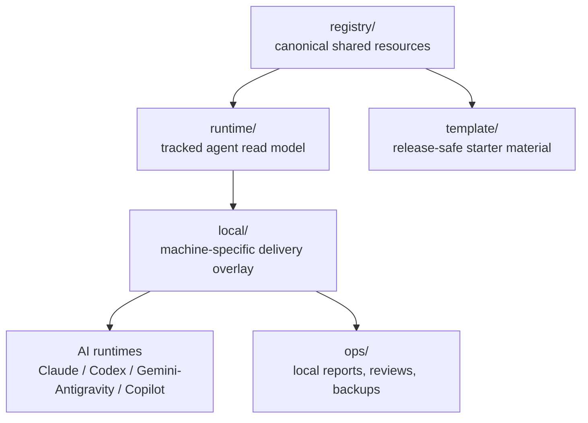

# UniText

[概覽](#概覽) · [架構](#架構) · [快速開始](#快速開始) · [Runtime](#給-agent-的-runtime-入口) · [文件](#文件地圖) · [English](../../README.md)

> 給 Claude Code、Codex、Gemini / Antigravity、GitHub Copilot 與相鄰 runtime 使用的 registry-first AI agent 共享資源治理層。

UniText 把 skills、MCP definitions、agent instructions、workflow templates、runtime projections 與本機 delivery wiring 維持在同一個可審查的 source of truth。它的目標很直接：共享資源只 author 一次，先提供低噪音 runtime view 給 agents，再透過 dry-run、review、backup、verify gates 交付到各 host tools。

UniText 是 local-first。即使 publishability report 乾淨、remote 是 private，或 GitHub template 已存在，也不代表可以 push、upload、paste 或 publish。任何對外發布都必須有使用者明確授權。

## 概覽

| 需求 | UniText surface |
|---|---|
| Author 共享資源 | `registry/` 保存 canonical skills、MCP definitions、agents、workflows |
| 給 agents 短啟動路徑 | `RUNTIME.md` 與 `runtime/` 提供 discovery-first read model |
| 安全對接本機工具 | `local/` 保存 bootstrap、verify、sync、boundary scripts |
| 保留本機 evidence | `ops/` 保存 reports、review packages、backups、evidence bundles |
| 匯出乾淨 starter | `template/` 保存 release-safe starter material |

## 架構

UniText 不取代 Claude、Codex、Gemini / Antigravity 或 Copilot 的原生設定格式。它提供共同治理層，讓同一份資源先被 review，再有意識地投影到各 runtime surface。



## 快速開始

### Windows

```powershell
powershell -NoProfile -ExecutionPolicy Bypass -File .\local\scripts\git-startup.ps1
python .\local\scripts\bootstrap.py --dry-run
python .\local\scripts\bootstrap.py --force
python .\local\scripts\verify-bootstrap.py
```

### macOS / Linux

```bash
python local/scripts/bootstrap.py --dry-run
python local/scripts/bootstrap.py --force
python local/scripts/verify-bootstrap.py
```

## 給 Agent 的 Runtime 入口

Agents 與 automation 應先讀：

```text
RUNTIME.md
runtime/START.md
runtime/RULES.md
runtime/ROUTES.md
runtime/catalog.json
```

## 文件地圖

| File | Purpose |
|---|---|
| [RUNTIME.md](../../RUNTIME.md) | Agent-first startup entrypoint |
| [INDEX.md](../../INDEX.md) | Human discovery、catalog excerpts、task routing |
| [VISION.md](../../VISION.md) | 說明 UniText 為何採 registry-first 與 runtime-first architecture |
| [RESOURCE_SPEC.md](../../RESOURCE_SPEC.md) | Shared resources 的 metadata 與 projection contract |
| [OPERATIONS.md](../../OPERATIONS.md) | Delivery modes、backup rules、mutation gates、troubleshooting |
| [NO_PUBLISH_POLICY.md](../../NO_PUBLISH_POLICY.md) | No-publish boundary |

## 測試

```bash
python -m unittest discover -s tests -p "test*.py"
python -m unittest tests.test_registry_inventory tests.security.test_i18n_drift tests.security.test_workspace_sensitive_metadata tests.security.test_release_hygiene
```

## 授權

[MIT License](../../LICENSE)
