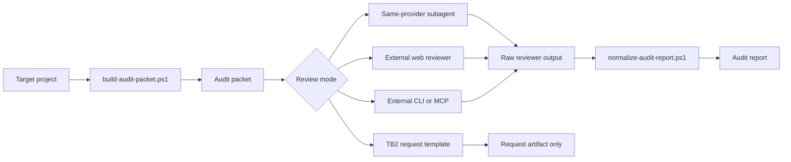
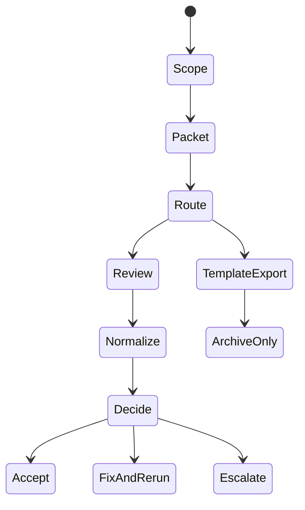

# External Audit Orchestrator

[繁體中文](README.zh-TW.md)

> Repeatable external audit packets, reviewer routing, source attribution, and normalized findings for development-time review gates.

External Audit Orchestrator turns ad hoc "please review this" handoffs into a stable skill workflow. It builds audit packets from real project evidence, routes them through one supported reviewer mode, and normalizes reviewer output into a consistent audit report. The package is designed for local-first development, explicit provenance, and read-only review unless the user asks for auto-fix.

## Features

- **Audit packet builder** - captures scope, project context, git evidence, checks, questions, and reference inputs
- **Mode-specific routing** - supports `same-provider-subagent`, `external-web`, `external-cli-mcp`, and `tb2-template`
- **TB2 template export** - writes request artifacts for future TB2 reviewer handoff without claiming live execution
- **Claude reviewer bundle** - exports a read-only reviewer subagent template and optional settings hook
- **Report normalizer** - converts JSON-first or legacy Markdown reviewer output into one report shape
- **Source attribution guardrail** - requires local paths, URLs, and reasons for any outside reference used

## Architecture



## Installation

This package is a Codex/UniText skill package. In the UniText source tree, the canonical authoring copy lives under:

```text
registry/skills/external-audit-orchestrator
```

The consumer runtime projection lives under:

```text
runtime/skills/external-audit-orchestrator
```

For package release, follow the checklist in [references/release-checklist.md](references/release-checklist.md). Package export is handled from the UniText repository root.

## Quick Start

### Windows PowerShell

```powershell
# 1. Point to the installed skill and the project to review.
$skillRoot = "Q:\UniText\runtime\skills\external-audit-orchestrator"
$targetProject = "Q:\Projects\your-project"

# 2. Build a working-tree audit packet and prepare the default same-provider flow.
powershell -NoProfile -ExecutionPolicy Bypass -File "$skillRoot\scripts\run-external-audit-flow.ps1" `
  -SkillRoot $skillRoot `
  -TargetProject $targetProject `
  -Mode same-provider-subagent `
  -ScopeType WorkingTree `
  -Summary "Review the current working tree before acceptance." `
  -Question "Are there blocking bugs, security risks, or missing tests?" `
  -Check "Local tests were run before this audit."
```

### External Web Review

```powershell
$skillRoot = "Q:\UniText\runtime\skills\external-audit-orchestrator"
$targetProject = "Q:\Projects\your-project"

powershell -NoProfile -ExecutionPolicy Bypass -File "$skillRoot\scripts\run-external-audit-flow.ps1" `
  -SkillRoot $skillRoot `
  -TargetProject $targetProject `
  -Mode external-web `
  -ScopeType Path `
  -ScopeValue "src/auth" `
  -Summary "Prepare a visible, human-supervised web review packet."
```

Copy the generated packet into the chosen web reviewer, save the raw reviewer response locally, then rerun the flow with `-RawReviewPath` to normalize the report.

### TB2 Template Export

```powershell
$skillRoot = "Q:\UniText\runtime\skills\external-audit-orchestrator"
$targetProject = "Q:\Projects\your-project"

powershell -NoProfile -ExecutionPolicy Bypass -File "$skillRoot\scripts\run-external-audit-flow.ps1" `
  -SkillRoot $skillRoot `
  -TargetProject $targetProject `
  -Mode tb2-template `
  -ScopeType WorkingTree `
  -Summary "Export TB2 request artifacts for future reviewer execution." `
  -Apply
```

TB2 mode exports request JSON only unless live TB2 reviewer tools are explicitly available. The exported request is not evidence that a reviewer ran.

## Command Reference

| Script | Description |
|---|---|
| `scripts/run-external-audit-flow.ps1` | Unified entrypoint for packet build, mode-specific export, and optional report normalization |
| `scripts/build-audit-packet.ps1` | Builds the Markdown audit packet from target project evidence |
| `scripts/normalize-audit-report.ps1` | Converts raw reviewer output into the standard audit report format |
| `scripts/export-tb2-audit-request.ps1` | Exports TB2 reviewer request JSON and manifest artifacts |
| `scripts/export-claude-reviewer-bundle.ps1` | Exports the Claude read-only reviewer template and settings snippet |

## Modes

| Mode | Best For | Output |
|---|---|---|
| `same-provider-subagent` | Default v0.1 review path - local subagent or parallel reviewer flow | Audit packet, reviewer output, normalized report when raw output exists |
| `external-web` | Visible, human-supervised review through a browser product | Audit packet and operator instructions; report after saved raw output |
| `external-cli-mcp` | Stable CLI or MCP reviewer toolchains | Audit packet and operator instructions; report after captured stdout or transcript |
| `tb2-template` | Traceable future TB2 reviewer handoff | TB2 request JSON and manifest; no live review claim |

## Core Workflow



**Workflow:**

1. Determine scope: `WorkingTree`, `Staged`, `CommitRange`, `Path`, or `Manual`.
2. Build the audit packet with real evidence and concrete reviewer questions.
3. Choose exactly one mode unless the user requested multiple reviewer perspectives.
4. Keep the reviewer read-only unless auto-fix was explicitly requested.
5. Normalize raw reviewer output into the standard report shape.
6. Decide `accept`, `fix-and-rerun`, `escalate-to-human`, or `archive-only`.

## Tutorial

For a complete walkthrough, see [docs/USAGE.md](docs/USAGE.md).

## Testing

Run validation from the UniText repository root:

```powershell
.\validation\run-smoke.ps1
```

For portable or CI environments without the Codex mirror:

```powershell
.\validation\run-smoke.ps1 -SkipCodexMirror
```

The smoke test covers parser checks, audit packet generation, report normalization, TB2 request export, Claude bundle dry-run behavior, and unified flow runner output.

## AI-Assisted Development

This project was developed with AI assistance.

| Model | Role |
|---|---|
| OpenAI Codex | Documentation authoring, repository inspection, and README structure alignment |

> Warning: While the author has made every effort to review and validate the AI-generated code and documentation, no guarantee can be made regarding its correctness, security, or fitness for any particular purpose. Use at your own risk.

## License

[MIT License](../../../LICENSE)
