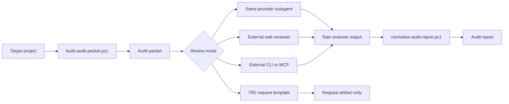
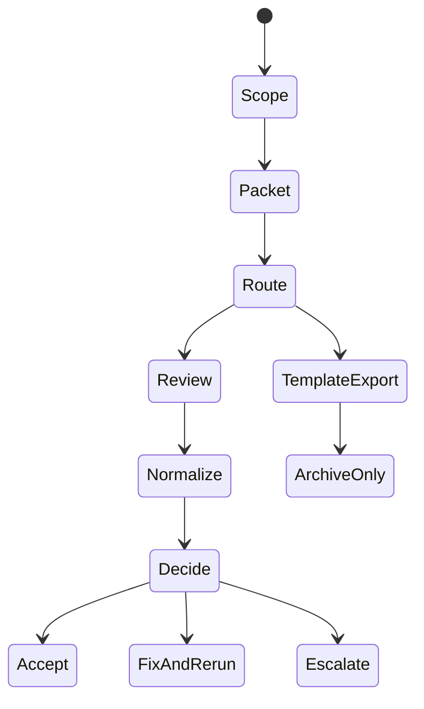

# External Audit Orchestrator

[English](README.md)

> 可重複執行的外部審查封包、reviewer 路由、來源標註與標準化 findings，適合開發期間的 review gate。

External Audit Orchestrator 將臨時性的「請幫我 review」交接，整理成穩定的 skill workflow。它會從真實專案證據建立 audit packet，依照單一支援模式交給 reviewer，並把 reviewer output 正規化成一致的 audit report。這個 package 採 local-first 設計，重視明確 provenance，且除非使用者要求 auto-fix，review 預設維持 read-only。

## Features

- **Audit packet builder** - 擷取 scope、project context、git evidence、checks、questions 與 reference inputs
- **Mode-specific routing** - 支援 `same-provider-subagent`、`external-web`、`external-cli-mcp`、`tb2-template`
- **TB2 template export** - 輸出可交給未來 TB2 reviewer 的 request artifacts，但不宣稱 live execution 已完成
- **Claude reviewer bundle** - 匯出 read-only reviewer subagent template 與 optional settings hook
- **Report normalizer** - 將 JSON-first 或 legacy Markdown reviewer output 轉成統一 report shape
- **Source attribution guardrail** - 要求所有外部參考都列出 local path、URL 與使用理由

## Architecture



## Installation

這是一個 Codex/UniText skill package。在 UniText source tree 中，canonical authoring copy 位於：

```text
registry/skills/external-audit-orchestrator
```

consumer runtime projection 位於：

```text
runtime/skills/external-audit-orchestrator
```

若要 release package，請依照 [references/release-checklist.md](references/release-checklist.md)。package export 從 UniText repository root 執行。

## Quick Start

### Windows PowerShell

```powershell
# 1. 指定已安裝 skill 與要審查的專案。
$skillRoot = "Q:\UniText\runtime\skills\external-audit-orchestrator"
$targetProject = "Q:\Projects\your-project"

# 2. 建立 working-tree audit packet，並準備預設 same-provider flow。
powershell -NoProfile -ExecutionPolicy Bypass -File "$skillRoot\scripts\run-external-audit-flow.ps1" `
  -SkillRoot $skillRoot `
  -TargetProject $targetProject `
  -Mode same-provider-subagent `
  -ScopeType WorkingTree `
  -Summary "Review the current working tree before acceptance." `
  -Question "Are there blocking bugs, security risks, or missing tests?" `
  -Check "Local tests were run before this audit."
```

### External Web Review

```powershell
$skillRoot = "Q:\UniText\runtime\skills\external-audit-orchestrator"
$targetProject = "Q:\Projects\your-project"

powershell -NoProfile -ExecutionPolicy Bypass -File "$skillRoot\scripts\run-external-audit-flow.ps1" `
  -SkillRoot $skillRoot `
  -TargetProject $targetProject `
  -Mode external-web `
  -ScopeType Path `
  -ScopeValue "src/auth" `
  -Summary "Prepare a visible, human-supervised web review packet."
```

把產出的 packet 貼到指定 web reviewer，將 raw reviewer response 存成本機檔案，再用 `-RawReviewPath` 重新執行 flow 以產生標準化 report。

### TB2 Template Export

```powershell
$skillRoot = "Q:\UniText\runtime\skills\external-audit-orchestrator"
$targetProject = "Q:\Projects\your-project"

powershell -NoProfile -ExecutionPolicy Bypass -File "$skillRoot\scripts\run-external-audit-flow.ps1" `
  -SkillRoot $skillRoot `
  -TargetProject $targetProject `
  -Mode tb2-template `
  -ScopeType WorkingTree `
  -Summary "Export TB2 request artifacts for future reviewer execution." `
  -Apply
```

TB2 mode 只會輸出 request JSON；除非 runtime 明確提供 live TB2 reviewer tools，否則不代表 reviewer 已執行。

## Command Reference

| Script | Description |
|---|---|
| `scripts/run-external-audit-flow.ps1` | 統一入口：建立 packet、執行 mode-specific export，並可選擇正規化 report |
| `scripts/build-audit-packet.ps1` | 從 target project evidence 建立 Markdown audit packet |
| `scripts/normalize-audit-report.ps1` | 將 raw reviewer output 轉成標準 audit report format |
| `scripts/export-tb2-audit-request.ps1` | 匯出 TB2 reviewer request JSON 與 manifest artifacts |
| `scripts/export-claude-reviewer-bundle.ps1` | 匯出 Claude read-only reviewer template 與 settings snippet |

## Modes

| Mode | Best For | Output |
|---|---|---|
| `same-provider-subagent` | v0.1 預設 review path - local subagent 或 parallel reviewer flow | Audit packet；有 raw output 時可產生 normalized report |
| `external-web` | 透過 browser product 進行可見、人工監督的 review | Audit packet 與 operator instructions；保存 raw output 後產生 report |
| `external-cli-mcp` | 穩定 CLI 或 MCP reviewer toolchain | Audit packet 與 operator instructions；保存 stdout/transcript 後產生 report |
| `tb2-template` | 可追蹤的未來 TB2 reviewer handoff | TB2 request JSON 與 manifest；不宣稱 live review |

## Core Workflow



**Workflow:**

1. 決定 scope：`WorkingTree`、`Staged`、`CommitRange`、`Path` 或 `Manual`。
2. 用真實 evidence 與具體 reviewer questions 建立 audit packet。
3. 除非使用者要求多 reviewer 視角，否則只選一種 mode。
4. 除非明確要求 auto-fix，reviewer 維持 read-only。
5. 將 raw reviewer output 正規化成標準 report shape。
6. 決定 `accept`、`fix-and-rerun`、`escalate-to-human` 或 `archive-only`。

## Tutorial

完整教學請見 [docs/USAGE.zh-TW.md](docs/USAGE.zh-TW.md)。

## Testing

從 UniText repository root 執行 validation：

```powershell
.\validation\run-smoke.ps1
```

在沒有 Codex mirror 的 portable 或 CI 環境：

```powershell
.\validation\run-smoke.ps1 -SkipCodexMirror
```

smoke test 會涵蓋 parser checks、audit packet generation、report normalization、TB2 request export、Claude bundle dry-run behavior 與 unified flow runner output。

## AI-Assisted Development

This project was developed with AI assistance.

| Model | Role |
|---|---|
| OpenAI Codex | Documentation authoring, repository inspection, and README structure alignment |

> Warning: While the author has made every effort to review and validate the AI-generated code and documentation, no guarantee can be made regarding its correctness, security, or fitness for any particular purpose. Use at your own risk.

## License

[MIT License](../../../LICENSE)
